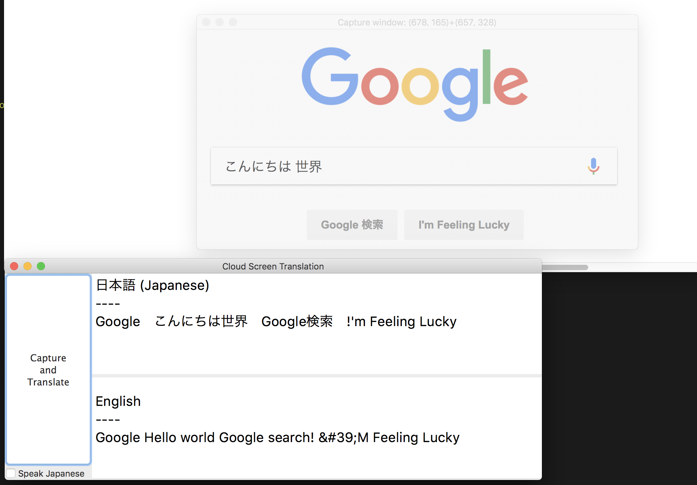

# Cloud Screen Translation

**Cloud Screen Translation** is a cross-platform application to support to read text on the screen written in foreign languages. It detect text in the screen and translate it (optionally speak aloud it by synthesis voice). It is highly powered by [Google Cloud Platform](https://cloud.google.com/).

## Download (for Windows user)
[CloudScreenTranslation-v0.1.0.zip](https://github.com/shuuji3/cloud-screen-translation/raw/master/dist-win/CloudScreenTranslation-v0.1.0.zip)

## Usage
1. Prepare your own [service account key of Google Cloud Platform](https://cloud.google.com/iam/docs/managing-service-account-keys) and save it as `service_account_creds.json` on this directory.
1. Run `python main.py` (Windows: Extract `CloudScreenTranslation-v0.1.0.zip` and run `CloudScreenTranslation.cmd`).
1. Move the transparent *Capture Window* to the translation target area like the above screenshot.
1. Click *Capture and Translation* button on the *Main Window*.
1. The detected Japanese text will be appended in the above textbox and the translated English in the bottom.

## Development
1. Prepare your own [service account key of Google Cloud Platform](https://cloud.google.com/iam/docs/managing-service-account-keys) and save it as `service_account_creds.json` on this directory.
1. Install [Python3](https://www.python.org/).
1. Run `pip install -r requirements.txt` to install required libraries.
1. Run `pip install -r requirements-dev.txt` to install required libraries for development.
1. (For Windows) Run `pip install -r requirements-win.txt`.
1. Run `python main.py`.

## License

[GNU General Public License v3](LICENSE)